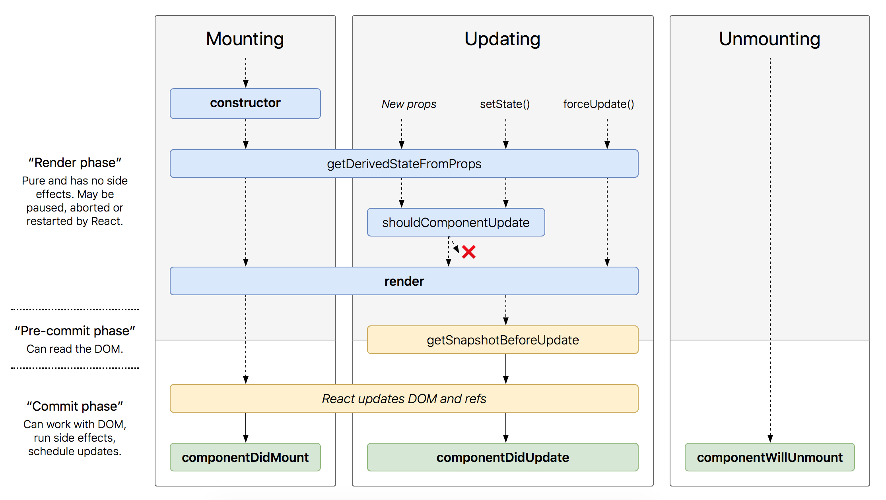

# React Worksheet

- [React Worksheet](#react-worksheet)
  - [Introduction](#introduction)
    - [Intro to JSX -](#intro-to-jsx)
      - [const & let](#const--let)
    - [ReactDOM](#reactdom)
      - [Clock ticking example -](#clock-ticking-example)
    - [Hot module replacement](#hot-module-replacement)
    - [Complex javascript in JSX](#complex-javascript-in-jsx)
      - [Convert to react component](#convert-to-react-component)
  - [Basics in React](#basics-in-react)
    - [ES6 Object Initializer](#es6-object-initializer)
    - [Unidirectional Data Flow](#unidirectional-data-flow)
    - [Bindings](#bindings)
      - [Shortcut approach](#shortcut-approach)
    - [Event Handler](#event-handler)
    - [Interactions with Forms and Events](#interactions-with-forms-and-events)
      - [Search using input fields -](#search-using-input-fields)
    - [ES6 Destructuring](#es6-destructuring)
    - [Controlled Components](#controlled-components)
    - [Split up Components](#split-up-components)
      - [Props vs. State](#props-vs-state)
    - [Component Declarations](#component-declarations)
    - [Styling Components](#styling-components)
  - [Getting real with API](#getting-real-with-api)
    - [Lifecycle Methods -](#lifecycle-methods)
    - [Fetching Data](#fetching-data)
      - [Template Literals -](#template-literals)
      - [Fetch -](#fetch)
    - [ES6 Spread Operators](#es6-spread-operators)
    - [Conditional Rendering](#conditional-rendering)
    - [Client or server-side search](#clientorserversidesearch)

      

<a name="intro"></a>

## Introduction

<a name="introtojsx"></a>

### Intro to JSX -

JSX is neither a string nor HTML. It's a syntax extension to JavaScript. We recommend using it with React to describe what the UI should look like.

Variable declaration and use-

```javascript
var helloworld = "Welcome to the app";
<div className="App">
    <h2>{helloworld}</h2>
</div>

function formatName(user) {
  return user.firstName + ' ' + user.lastName;
}
<div className="App">
    <h2>{formatName(user)}</h2>
</div>
```

#### const & let

1. const = constant. cannot be re-assigned or re-declared.

2. let = can be re-assigned.

    // not allowed

    `const helloWorld = 'Welcome to the Road to learn React';`

    `helloWorld = 'Bye Bye React';`

    //allowed

    `let helloWorld = 'Welcome to the Road to learn React';`

    `helloWorld = 'Bye Bye React';`

<a name="reactdom"></a>

### ReactDOM

ReactDOM.render() uses a DOM node in your HTML to replace it with JSX.
**element** doesn't have to be a JSX component instance, it can also be simple HTML

element = `<h1>Hello react world</h1>`

```javascript
ReactDOM.render(
  element, //for rendering JSX
  document.getElementById('root') //place where react application hook into the HTML
);
```

#### Clock ticking example -

```javascript
function tick() {
    const element = (
        <div>
            <h1>Hello, world!</h1>
            <h2>It is {new Date().toLocaleTimeString()}</h2>
        </div>
    );
      // highlight-next-line
      ReactDOM.render(element, document.getElementById('root'));
}
setInterval(tick, 1000);

Output--
Hello, world!
It is 7:43:12 PM. // only the time get's updated, not any other HTML
```

<a name="hotmodulereloading"></a>

### Hot module replacement

Tool to reload the application in the browser without the page refresh. Add that in `src/App.js`

```javascript
if (module.hot) {
    module.hot.accept();
}
```

​    
<a name="complexjsinjsx"></a>

### Complex javascript in JSX

Inside `src/App.js`

**Keys**: help React identify which items have changed, are added, or are removed. Keys should be given to the elements inside the array to give the elements a stable identity

Data-

```javascript
const list = [
      {
        title: 'React',
        url: 'https://reactjs.org/',
        author: 'Jordan Walke',
        num_comments: 3,
        points: 4,
        objectID: 0,
      },
      {
        title: 'Redux',
        url: 'https://redux.js.org/',
        author: 'Dan Abramov, Andrew Clark',
        num_comments: 2,
        points: 5,
        objectID: 1,
      },
];
```

Code -

```javascript
class App extends Component {
         render() {
            return (
                  <div className="App">
                    {list.map(function(item) {
                          return (
                            <div key={item.objectID}>
                                  <span>
                                    <a href={item.url}>{item.title}</a>
                                  </span>
                                  <span>{item.author}</span>
                                  <span>{item.num_comments}</span>
                                  <span>{item.points}</span>
                            </div>
                          );
                    })}
                  </div>
            );
          }
    }
```

> Warning - When you don’t have stable IDs for rendered items, you may use the item index as a key as a last resort

##### Convert to react component

Convert the above code into a react component. This makes it easily reusable anywhere on the app.

```javascript
    function ListAPI(props){
      const listItems = props.list.map((item) =>
          <div key={item.objectID}>
            <span>
              <a href={item.url}>{item.title}</a>
            </span>
            <span>{item.author}</span>
            <span>{item.num_comments}</span>
            <span>{item.points}</span>
          </div>
      )
      return listItems;
    }

    class App extends Component {
      render() {
        return (
          <div className="App">
            <ListAPI list={list} />
          </div>
        );
      }
    }
```

Javascript array properties - [https://developer.mozilla.org/en-US/docs/Web/JavaScript/Reference/Global_Objects/Array](https://developer.mozilla.org/en-US/docs/Web/JavaScript/Reference/Global_Objects/Array)

<a name="basicsinreact"></a>

## Basics in React

<a name="es6objectinitializer"></a>

### ES6 Object Initializer

1. Use shorthand notation to initialize the object, if the property name is same as variabe name.

| ES5                                                                    | ES6                                                               |
| ---------------------------------------------------------------------- | ----------------------------------------------------------------- |
| `const name = 'Robin';`<br/>`const user = {`<br/>`name:name,`<br/>`};` | `const name = 'Robin';`<br/>`const user = {`<br/>`name,`<br/>`};` |

2. **Method definition** - A property of an object can also refer to a function or a getter or setter method.

```javascript
   var o = {
        property: function (parameters) {},
        get property() {},
        set property(value) {}

       //can also do something like this
       property(parameters) {},       
       *generator() {}
   };
```

   ​
   <a name="unidirectionaldataflow"></a>

### Unidirectional Data Flow

3. constructor(props) => **Intialize state**
4. this.setState()    => **Update state**
5. Button click       => **View updated state**

I have a object called `items` with a list of arrays in it. To Intialize the state of this object in the Component:

```javascript
constructor(props){
    this.state = {
        initList: list
    }
}
```

To update the state when a button is clicked:

```javascript
<button
  onClick={() =>
    this.onDismiss(item.id)
  } type="button">
  Dismiss
</button> 

onDismiss(id){
    const isNotId = item => {return item.id !== id};
    const updatedList = this.state.initList.filter(isNotId);
    //UPDATE STATE
    this.setState({ list: updatedList });
}
```

<a name="bindings"></a>

### Bindings

Before using `this` inside any class method, the method need to be bind to the class. Always bind the method inside the constructor, never anywhere else.

//correct

```javascript
constructor(){
    this.function_name.bind(this);   
}
```

//wrong

```javascript
render() {
    return (
      <button
        onClick={this.function_name.bind(this)}
        type="button"
      >
        Click Me
      </button>
    );
}
```

This is because every time the render method is called(component is updated), it'll bind the method which will affect the application performance.

#### Shortcut approach

To avoid repetitive binding inside the constructor for each method, use Javascript ES6 approach when creating method: 

function_name = () => {
​    console.log(this);
  } 

[https://github.com/the-road-to-learn-react/react-alternative-class-component-syntax](https://github.com/the-road-to-learn-react/react-alternative-class-component-syntax)

<a name="eventhandler"></a>

### Event Handler

Inside render() function-

```javascript
//wrong
<button
    onClick = {this.function_name(item)}
type="button">
```

This won't work because When using `onClick={function_name()}`, the function_name() function executes immediately when the application is opened in a browser. 

To fix this always use `onClick={() => function_name()}` because this code will only be executed when the button is pressed.  These are called **higher order function**

<a name="formsandevents"></a>

### Interactions with Forms and Events

Input field -  

`<input type="text" onChange={this.onSearchChange} />`

Use **Synthetic Events** to get the input value

`onSearchChange(event){ console.log(event.target.value); }`

#### Search using input fields -

`isSearched` is a function with `searchTerm` as parameter that holds the value of input.

This function returns another higher order function which is getting used inside a `filter()` method to filter the data 

```javascript
const isSearched = searchTerm => item => item.title.toLowerCase().includes(searchTerm.toLowerCase());
```

Call to `isSearched` - 

```javascript
{this.state.list.filter(isSearched(this.state.searchTerm)).map(item) =>
    //display each item
    ...
)}
```

**Events**: To prevent default when a link event clicked - 

1. In HTML ====================================

```javascript
<a href="#" onclick="console.log('The link was clicked.'); return false">
  Click me
</a>
```

2. In React =====================================

```javascript
function ActionLink() {
  function handleClick(e) {
    e.preventDefault();
    console.log('The link was clicked.');
  }
  return (
    <a href="#" onClick={handleClick}>
      Click me
        </a>
  );
}
```

<a name="es6destructuring"></a>

### ES6 Destructuring

Assign variable to each array/JSON objects.

```javascript
const users = ['Robin', 'Andrew', 'Dan'];
const [userOne, userTwo, userThree, userFour = '4'] = users;

console.log(userOne, userTwo, userThree, userFour);
// output: Robin Andrew Dan 4
//It shows the default value 4 for userFour since nothing provided

const {num1, num2, num3} = {'1', '2', '3'};
const [x, y, ...z] = [1,2,3,4,5];    //x=1, y=2, z=[3,4,5]
```

<a name="controlledcomponents"></a>

### Controlled Components

Form components like `<input>`, `<textarea>`, `<select>` all accept a `value` attribute that you can use to implement a controlled component. So it get's easier to control all these elements

```javascript
this.state.value = "coconut";

<textarea value={this.state.value..toUpperCase()} onChange={this.handleChange} /> //placeholder is "COCONUT". Always in uppercase
<select value={this.state.value} onChange={this.handleChange}>
  <option value="grapefruit">Grapefruit</option>
    <option value="lime">Lime</option>
    <option value="coconut">Coconut</option>  //selected
</select>
```

<a name="splitupcomponents"></a>

### Split up Components

We can split different html elements into components. For ex make a search component with a `<form>`, `<label>` and `<input>` into a `<Search>` component.

```javascript
  class Search extends Component {
    render() {
          //this.props contains all the values passed from the calling class
        const { value, onChange, children } = this.props;
        //console.log(this.props);
        return (
        <form>
            {children}
            <input
            type="text"
            value={value}
            onChange={onChange}
            />
        </form>
        );
    }
  }
```

And this can be called from any other class, like this

```javascript
    //searchTerm is the input value
    //onChange contains the change function
    //children is <label>Search</label>
  <Search
      value={searchTerm}
      onChange={this.onSearchChange}
  >
  <label>Search</label>
  </Search>
```

##### Props vs. State

Passing only props from component to component doesn’t make the component interactive, because nothing is there to change the props. Props are read-only. That’s the time when React state comes into play which can be changed.

```javascript
//inside constructor of parent component
constructor(props){
  super(props);
  this.state = { isShown: true };
}
//parent level function that change the state based on the props from children component
toggleShow = () => {
  this.setState((state) => ({ isShow: !state.isShow }));
};
//Toggle the greeting message when button is pressed 
render() {
  const greeting = 'Welcome to React';
  return (
    <div>
    <Greeting greeting={greeting} isShow={this.state.isShow} />
    <button onClick={this.toggleShow} type="button">
        Toggle Show
    </button>
    </div>
  );
}

//Child Component
function Greeting(props){
  const {greeting, isShow} = props;
  return isShow ? <h1>{greeting}</h1> : null;
}
```

As said, there is no way passing props from a child to a parent component. But**you can always pass functions from parent to child components**, whereas the child components make use of these functions and the functions may change the state in a parent component above. Once the state has changed, the state is passed down as props again.

<a name="componentdeclarations"></a>

### Component Declarations

| Functional Stateless Component                                                                                                 | ES6 Class Component                                                                   |
| ------------------------------------------------------------------------------------------------------------------------------ | ------------------------------------------------------------------------------------- |
| `function Button(props){  }`                                                                                                   | `class Button extends Component`                                                      |
| props can be accessed by the function parameter.                                                                               | props can be accesed by `this.props`                                                  |
| You cannot access or update the state with `this.state` or `this.setState()`                                                   | You can access or update the states.                                                  |
| Does not contains any lifecycle method besides `render()` which will be applied implicitly in functional stateless components. | Contains all the lifecycle methods including `constructor`, `render()` and many more. |
| Used where the props state is not gonna change. Read only. For example: A Label.                                               | Used where the props value change all the time. For example: on button press          |

**ES6 Simplfication of a function**

This can be simplified 

```
function Search(prompt){
  const {value, onChange, children} = prompt;
  return(
    <form>
        {children}
        <input
        type="text"
        value={value}
        onChange={onChange}
        />
    </form>
  )
}
```

to - 

```
const Search = ({value, onChange, children}) =>
    <form>
        {children}
        <input
        type="text"
        value={value}
        onChange={onChange}
        />
    </form>
```

<a name="stylingcomponents"></a>

### Styling Components

| className                                                                                                          | inline style                                                            | variable style                                                                                                                                  |
| ------------------------------------------------------------------------------------------------------------------ | ----------------------------------------------------------------------- | ----------------------------------------------------------------------------------------------------------------------------------------------- |
| You can give property `className` to any HTML item and style it that way. `className` is same as `class` in react. | Inside any HTML element add style attribute, `style={{ width: '30%' }}` | To clean up inline styling, assign property to a variable<br/> `const largeCol = { width: '40%'}` and assign variable, <br/> `style={largeCol}` |

[Styled Components](https://github.com/styled-components/styled-components)

[CSS Modules](https://github.com/css-modules/css-modules)

<a name="gettingrealwithapi"></a>

## Getting real with API

<a name="lifecyclemethods"></a>

### Lifecycle Methods -

Type of lifecycle methods - 

1. constructor()

2. render() - 

   1. return element. It shouldn't modify the component state.

3. static getDerivedStateFromProps(props, state) - 

   1. called both on the initial mount and on the subsequent updates. Return object to update state. It's a static method so no access to component instance. 

4. componentDidMount() - 

   1. called once when the component is mounted. That’s the perfect time to do an asynchronous request to fetch data from an API. The fetched data is stored in the local component state to display it in the render() lifecycle method.

Which method get called first to last - 
`constructor()` --> `getDerivedStateFromProps()` --> `render()` --> `componentDidMount()`

For the `update` lifecycle of a component when the state or the props change, there are 5 lifecycle methods, in the following order:

1. getDerivedStateFromProps()
2. shouldComponentUpdate(nextProps, nextState) - 
   1. called when the component updates due to state or prop change. 
   2. return boolean. If false, component won't update. 
   3. Helps in speed improvement of project
3. render()
4. getSnapshotBeforeUpdate(prevProps, prevState) - 
   1. called right before the DOM changes appear to the user. return value that can be accessed inside componentDidUpdate() method as a parameter. 
5. componentDidUpdate(prevProps, prevState, snapshot) - 
   1. called immediately after updating.Helpful in fetching data from an API.  `snapshot` parameter contains the value recieved from getSnapshotBeforeUpdate() method. 
   2. ```javascript
      componentDidUpdate(prevProps) {
        // Typical usage (don't forget to compare props):
        if (this.props.userID !== prevProps.userID) {
          this.fetchData(this.props.userID);
        }
      }
      ```

`componentDidCatch(error, info)` - New method added to catch error in componets. You can catch the error, store it in your local state, and show a message to the user.

Graph - 

**Clock example with states** - [https://reactjs.org/docs/state-and-lifecycle.html](https://reactjs.org/docs/state-and-lifecycle.html)

<a name="fetchingdata"></a>

### Fetching Data

const DEFAULT_QUERY = 'redux';
const PATH_BASE = 'https://hn.algolia.com/api/v1';
const PATH_SEARCH = '/search';
const PARAM_SEARCH = 'query=';

#### Template Literals -

  Need back ticks`, dollar sign($) and curly brace

1. Variable inside a string ``` `string text ${expression} string text` ```. If a new line is inside these back ticks, it will automatically be treated as `\n`.

2. **Expression Interpolation** - ``` `Fifteen is ${a + b}` ``` 

3. String Concatination - ```const url = `${PATH_BASE}${PATH_SEARCH}?${PARAM_SEARCH}${DEFAULT_QUERY}`;```

#### Fetch -

```javascript
  fetch(`${PATH_BASE}${PATH_SEARCH}?${PARAM_SEARCH}${searchTerm}`) //fetch URL
      .then(response => response.json()) //response transformed into JSON data structure
      // when recieve data, it change the state of result.
      // State change re-render the component, which calls the render() method which populate the page with this new result.
      .then(result => this.setState({ result }))
      .catch(error => error);
```

Data fetching in react - [https://www.robinwieruch.de/react-fetching-data/](https://www.robinwieruch.de/react-fetching-data/)

<a name="es6spreadoperators"></a>

### ES6 Spread Operators

Normal spread

```javascript
  const userList = ['Robin', 'Andrew', 'Dan'];
  const additionalUser = 'Jordan';
  const allUsers = [ ...userList, additionalUser ];

  console.log(allUsers);
  // output: ['Robin', 'Andrew', 'Dan', 'Jordan']
```

merge array - 

```javascript
  const userList = ['Robin', 'Andrew'];
  const additionalUsers = ['Dan', 'Jordan'];
  const allUsers = [ ...userList, ...additionalUsers ];

  console.log(allUsers);
  // output: ['Robin', 'Andrew', 'Dan', 'Jordan']
```

**Object Spread operator** - This is react specific for now but will get implemented in future. 

```javascript
  const userNames = { firstname: 'Robin', lastname: 'Wieruch' };
  const age = 28;
  const user = { ...userNames, age };

  console.log(user);
  // output: { firstname: 'Robin', lastname: 'Wieruch', age: 28 }
```

current javascript way of joining objects ins by `Object.assign()`

`const mergedObj = Object.assign( {}, obj1, obj2 );`

<a name="conditionalrendering"></a>

### Conditional Rendering

In JavaScript a`true && 'Hello World'`always evaluates to ‘Hello World’. A`false && 'Hello World'`always evaluates to false.

```javascript
const result = true && 'Hello World';
console.log(result);
// Hello World

const result = false && 'Hello World';
console.log(result);
// false
```

In React you can make use of that behaviour. If the condition is true, the expression after the logical && operator will be the output. If the condition is false, React ignores and skips the expression.

```javascript
function LoadingIndicator({ isLoading }) {
  return (
    <div>
      { isLoading && <p>Loading...</p> }
    </div>
  );
}
```

Multiple conditional rendering - https://www.robinwieruch.de/conditional-rendering-react/#switch-case-operator


<a name="clientorserversidesearch"></a>

### Client or server-side search


